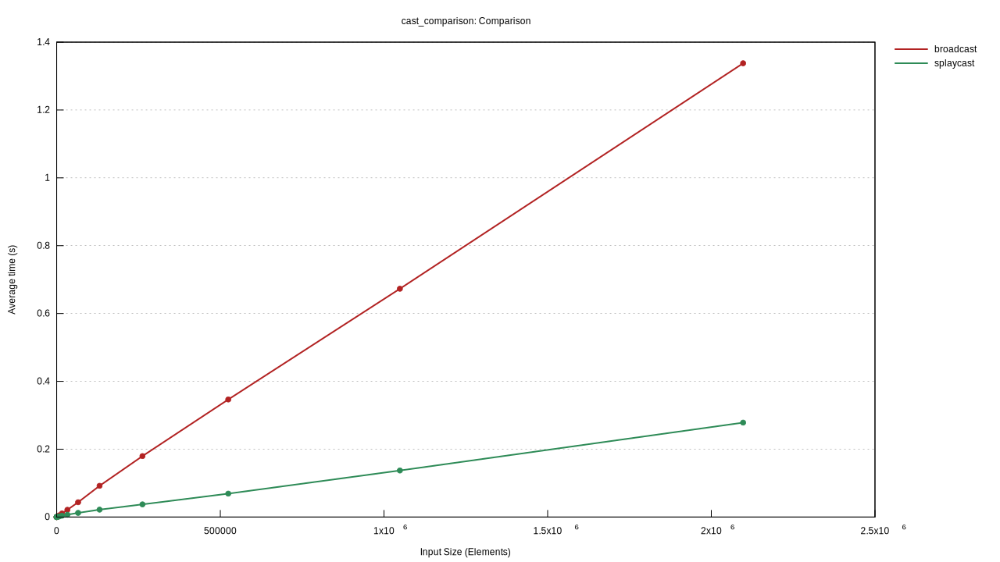
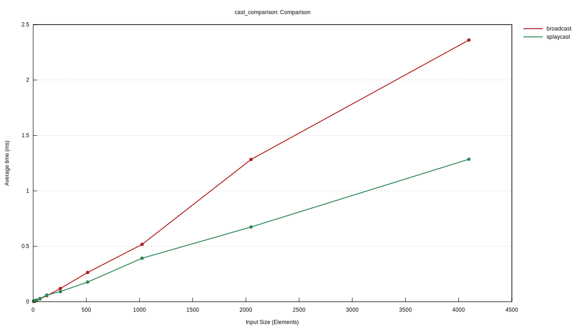

# Splaycast

For duplicating streams, like a broadcast.

Compared to the more general purpose and excellent `tokio::sync::broadcast`,
Splaycast is more application-specific and more amenable to huge numbers of
subscribers.

# About
This tool was developed to solve a problem with high contention observed on
a `tokio::sync::broadcast` with 10,000 - 200,000 subscribers. It was
manifesting as slow polls in Tokio metrics, and extremely high latency for
Receivers to get their messages - hundreds of milliseconds or much worse.

# Benchmarks
I've implemented a benchmark core that is generic over both Broadcast and
Splaycast, to test the differences between them in different scenarios -
varying queue depth, subscriber count, and thread count. At very low
subscriber counts, `tokio::sync::broadcast` is still the better choice.

There is an inflection point at about 128 subscribers where splaycast begins
to pull away, and by 16384 subscribers the difference is 12.27ms versus on
Splaycast versus 43.6ms on `tokio::sync::broadcast`. These tests were done
on a 64gb M1 laptop, so while relative differences are relevant, you should
be skeptical of absolute measurements.

With queue depth=4, "input size" along X is 4 times subscriber count. You can
see that as subscriber counts grow, the behavior of Splaycast is linear with
subscribers, but with a much lower constant factor than broadcast.

If we look closer at the bottom of the chart we can see the behavior more explicitly.
Here with the same queue depth=4 and "input size" means 4x subscriber count, you can
see that at or below 256 subscribers it doesn't make much of a difference which Stream
splitter you use. But at 512 and greater subscriber counts, the difference is
increasingly pronounced.
